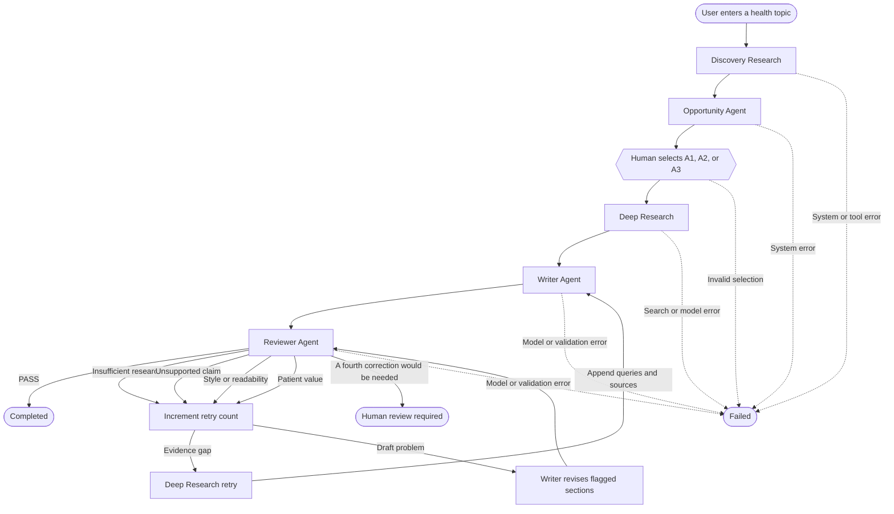

# Health Content Agent

A beginner-friendly multi-agent application that turns one health topic into
patient-focused article ideas and then into an evidence-grounded article draft.

The project uses Python, LangGraph, Nebius, the You.com Search API, and
Streamlit. It is designed as a learning project, so responsibilities are kept
small and explicit instead of hidden behind many abstraction layers.

## Problem statement

A mature consumer-health publisher usually already has foundational articles
such as “What is type 2 diabetes?” and broad summaries of symptoms, causes, and
treatments. Publishing more versions of those articles may not give readers
much new value.

This application starts with a free-form topic such as:

```text
Type 2 diabetes
Type 2 diabetes and sleep
```

It searches for more specific opportunities involving:

- questions patients are asking;
- challenges people face while managing a condition;
- decisions that require practical guidance;
- patient experiences and concerns; and
- meaningful recent developments with patient implications.

After a human chooses an article idea, the application gathers more focused
medical evidence, writes a cited article, and reviews it against the supplied
evidence and editorial style guide.

The application does **not** medically approve an article, diagnose a reader,
publish content automatically, or replace clinical review.

## Workflow diagram



LangGraph acts like the workflow conductor: it decides which already-defined
component runs next, carries shared state between components, pauses for the
human decision, and enforces the retry limit.

## What each node does

### 1. Discovery Research

File: `nodes/discovery.py`

Discovery asks, “What might be worth writing about for someone dealing with
this topic?”

- The Nebius LLM plans exactly three complementary search queries.
- Each query makes one You.com request.
- Available web and news results are both consumed.
- You.com Highlights are preserved rather than rewritten by the LLM.
- Python normalizes results into `Source` objects with IDs such as `D1`, `D2`,
  and `D3`.

Discovery is broad. It finds possible directions but does not choose the final
article idea or prove that enough evidence exists to write it.

### 2. Opportunity Agent

File: `nodes/opportunity.py`

The Opportunity Agent reads the topic and Discovery sources directly. In one
LLM call, it considers at least six candidates internally and returns the
strongest three.

It judges ideas using:

1. patient relevance;
2. specificity; and
3. usefulness or actionability.

Python assigns the stable IDs `A1`, `A2`, and `A3`. Each `ArticleIdea` contains
a title, article angle, and reason the topic may matter to patients.

### 3. Human Selection

Files: `graph.py`, `nodes/opportunity.py`, and `app.py`

LangGraph pauses after the Opportunity Agent. Streamlit displays all three
ideas and waits for the user to select exactly one.

The selected ID is returned to the same paused graph thread. Deterministic
Python looks up the matching idea and writes the complete `ArticleIdea` object
to `selected_idea`. Discovery and Opportunity do not run again.

### 4. Deep Research

File: `nodes/research.py`

Deep Research asks, “What evidence is needed to write this selected article?”

- The LLM reads the full selected idea and plans exactly three targeted
  queries.
- Each query makes one You.com request.
- Medical domains are preferred through domain boosting, not used as a strict
  allowlist.
- Web and news results become normalized `Source` objects with IDs such as
  `R1`, `R2`, and `R3`.
- Highlights remain unchanged.

If the Reviewer later identifies insufficient research, this node generates
three new queries using the feedback. New queries and sources are appended,
and R-numbering continues instead of replacing earlier evidence.

### 5. Writer Agent

File: `nodes/writer.py`

The Writer receives:

- the complete selected idea;
- all Deep Research sources; and
- `config/webmd_style.md`.

It returns a structured `ArticleDraft`, not one large Markdown string. The
draft contains reader-facing sections with stable machine-readable
`section_id` values.

Medical factual claims must come from the supplied evidence and use inline
citations such as `[R1]` or `[R1][R3]`. Python checks that every citation ID
exists in `deep_research_sources`.

For the MVP, the Writer also avoids detailed study statistics such as odds
ratios, confidence intervals, P-values, and regression coefficients. It uses
plain-language, evidence-faithful findings instead.

During a revision, the Writer changes only Reviewer-flagged sections. Unflagged
sections and their stable IDs remain unchanged.

### 6. Reviewer Agent

File: `nodes/reviewer.py`

The Reviewer compares the structured draft against the actual Deep Research
evidence and editorial guide. It judges support based on the supplied evidence,
not on the model’s general medical knowledge.

It returns one primary failure using this priority:

1. `insufficient_research`
2. `unsupported_claim`
3. `style_or_readability`
4. `patient_value`

For a failure, `flagged_sections` contains stable `section_id` values so the
Writer knows exactly which sections may change.

The Reviewer determines **what is wrong**. It does not choose the next graph
node.

### 7. Deterministic routing

File: `graph.py`

Ordinary Python determines **what happens next**:

- PASS → complete the automated workflow;
- insufficient research → return to Deep Research;
- other editorial failures → return to Writer revision; and
- three completed automated correction cycles → require human review instead
  of starting a fourth cycle.

This prevents an LLM from inventing graph transitions or creating an unlimited
loop.

## Supporting components

| File | Responsibility |
| --- | --- |
| `state.py` | Shared `Source`, `ArticleIdea`, `ArticleDraft`, review, error, and `GraphState` contracts |
| `tools/search.py` | You.com HTTP requests, web/news normalization, Highlights preservation, and deterministic source IDs |
| `prompts.py` | Task instructions for the LLM-based components |
| `llm.py` | One shared Nebius model configuration used by every LLM node |
| `config/webmd_style.md` | Reusable synthetic consumer-health editorial guidance |
| `graph.py` | LangGraph sequencing, interrupt/resume, routing, and retry enforcement |
| `app.py` | Thin Streamlit input, selection, progress, and result presentation layer |

## LLM work versus deterministic Python work

| LLM judgment | Deterministic Python |
| --- | --- |
| Plan search queries | Call You.com and validate HTTP responses |
| Recommend article ideas | Assign D#, R#, and A# IDs |
| Write article sections | Normalize results into `Source` objects |
| Review article quality | Validate structured models and citation IDs |
| Identify the primary failure | Select graph routes and enforce retry count |

You can think of the LLM as the team member handling judgment and language,
while Python is the operations checklist that performs exact, repeatable steps.

## State ownership

LangGraph state is the source of truth for live workflow data, including the
topic, evidence, ideas, selected idea, draft, review result, retry count, error,
and final status.

Streamlit session state stores only the active LangGraph thread ID, plus normal
widget values. The thread ID lets the UI reconnect to the correct in-memory
checkpoint after Streamlit reruns its script.

The current checkpointer is intentionally in memory. Restarting the application
clears active runs. End-of-run JSON persistence is not implemented yet.

## Setup

This project uses `uv`. From the project root, install the locked dependencies:

```bash
uv sync --dev
```

Add your real keys only to the local `.env` file:

```text
YOU_API_KEY=<your You.com key>
NEBIUS_API_KEY=<your Nebius key>
```

The `.env` file is ignored by Git. Do not put real credentials in
`.env.example` or source code.

## Run the Streamlit application

```bash
uv run streamlit run app.py
```

Then:

1. enter a health topic;
2. click **Research article ideas**;
3. review the three ideas;
4. select one idea;
5. click **Continue with selected idea**; and
6. wait for the research, writing, review, and possible correction cycle.

A completed run displays the structured article and a deterministic clickable
source list. A run that reaches the correction limit displays the latest draft
and Reviewer feedback for human review.

## Run the tests

```bash
uv run pytest
```

The unit and integration tests use mocked model and search results. They do not
call Nebius or You.com.

## Terminal workflow test

The complete graph can also be run without Streamlit:

```bash
uv run python -m graph
```

Use another topic with:

```bash
uv run python -m graph --topic "Type 2 diabetes and sleep"
```

## Standalone component smoke tests

```bash
# You.com web search
uv run python -m tools.search --type web

# Discovery only
uv run python -m nodes.discovery

# Discovery and Opportunity
uv run python -m nodes.opportunity

# Continue through Deep Research
uv run python -m nodes.opportunity --deep-research

# Continue through Writer
uv run python -m nodes.opportunity --writer

# Continue through Reviewer
uv run python -m nodes.opportunity --reviewer
```

These live smoke tests use your API credentials and may consume provider
credits.

## Current MVP boundaries

The application intentionally does not include:

- automatic publishing;
- clinical approval or full medical fact-checking;
- existing-content coverage checks;
- SEO or search-demand scoring;
- user accounts or saved workflow history;
- a database;
- final JSON run persistence; or
- autonomous search loops.

These boundaries keep the project understandable and make each component easy
to inspect and test independently.
